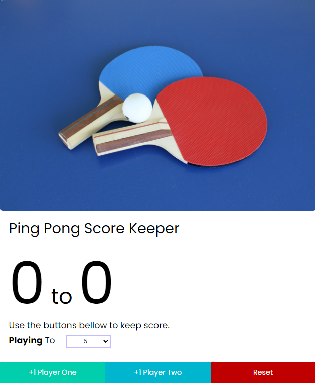

# Ping Pong Score App

This App keeps track of a ping pong game score, select the final score where the game will end, and add points for the player who scores. 
 
When the player hits the target score, the app will show who won and who lost in different colors. The player buttons will disable when the game ends, to start another game press the reset button.

 If the target score is changed midgame, the current score of the players will reset.

---

Photo by <a href="https://unsplash.com/@likeffer?utm_content=creditCopyText&utm_medium=referral&utm_source=unsplash">Lisa Keffer</a> on <a href="https://unsplash.com/photos/blue-and-white-ball-and-white-golf-club-3B8nIiT-Pmc?utm_content=creditCopyText&utm_medium=referral&utm_source=unsplash">Unsplash</a>
  